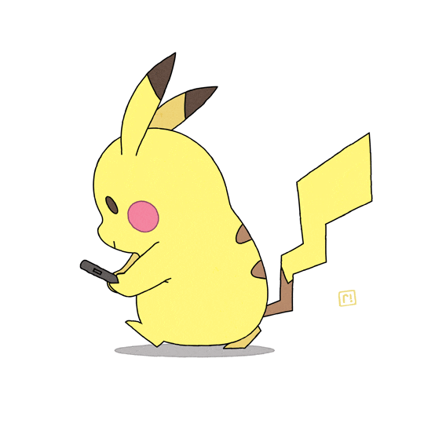

# Python Script Image Converter
### Sample Input GIF

### Output GIF

### Sample Frame Output in Hexadecimal Format
`{//Frame Number: 1
0x00, 0x00, 0x00, 0x00, 0x00, 0x00, 0x00, 0x00, 0x00, 0x00, 0x00, 0x00, 0x00, 0x00, 0x00, 0x00, 0x00, 0x00, 0x00, 0x00, 0x00, 0x00, 0x00, 0x00, 0x00, 0x00, 0x00, 0x00, 0x00, 0x00, 0x00, 0x00, 0xe0, 0xe0, 0xe0, 0xf0, 0xf0, 0xf0, 0xf0, 0xf0, 0xf0, 0xf0, 0xe0, 0xe0, 0xe0, 0xc0, 0xc0, 0xc0, 0x80, 0x00, 0x00, 0x00, 0x00, 0x00, 0x00, 0x00, 0x00, 0x00, 0x00, 0x00, 0x00, 0x00, 0x00, 0x00, 0x00, 0x00, 0x00, 0x00, 0x00, 0x00, 0x00, 0x00, 0x80, 0x80, 0xc0, 0xc0, 0xc0, 0xc0, 0xc0, 0x80, 0x00, 0x00, 0x00, 0x00, 0x00, 0x00, 0x00, 0x00, 0x00, 0x00, 0x00, 0x00, 0x00, 0x00, 0x00, 0x00, 0x00, 0x00, 0x00, 0x00, 0x00, 0x00, 0x00, 0x00, 0x00, 0x00, 0x00, 0x00, 0x00, 0x00, 0x00, 0x00, 0x00, 0x00, 0x00, 0x00, 0x00, 0x00, 0x00, 0x00, 0x00, 0x00, 0x00, 0x00, 0x00, 0x00, 0x00, 0x00,
0x00, 0x00, 0x00, 0x00, 0x00, 0x00, 0x00, 0x00, 0x00, 0x00, 0x00, 0x00, 0x00, 0x00, 0x00, 0x00, 0x00, 0x00, 0x00, 0x00, 0x00, 0x00, 0x00, 0x00, 0x00, 0x00, 0x00, 0x00, 0x00, 0x00, 0x0c, 0x7f, 0xff, 0xff, 0xff, 0xff, 0xff, 0xff, 0xff, 0xff, 0xff, 0xff, 0xff, 0xff, 0xff, 0xff, 0xff, 0xff, 0xff, 0xff, 0xff, 0xfe, 0xfc, 0xf8, 0xf8, 0xf0, 0xe0, 0x00, 0x00, 0x00, 0x00, 0x40, 0xc0, 0xc0, 0x80, 0x80, 0x00, 0x80, 0xf0, 0xfc, 0xfe, 0xff, 0xff, 0xff, 0xff, 0xff, 0x1f, 0x0f, 0x07, 0x07, 0x03, 0x00, 0x00, 0x00, 0x00, 0x00, 0x00, 0x00, 0x00, 0x00, 0x00, 0x00, 0x00, 0x00, 0x00, 0x00, 0x00, 0x00, 0x00, 0x00, 0x00, 0x00, 0x00, 0x00, 0x00, 0x00, 0x00, 0x00, 0x00, 0x00, 0x00, 0x00, 0x00, 0x00, 0x00, 0x00, 0x00, 0x00, 0x00, 0x00, 0x00, 0x00, 0x00, 0x00, 0x00, 0x00, 0x00, 0x00,
0x00, 0x00, 0x00, 0x00, 0x00, 0x00, 0x00, 0x00, 0x00, 0x00, 0x00, 0x00, 0x00, 0x00, 0x00, 0x00, 0x00, 0x00, 0x00, 0x00, 0x00, 0x00, 0x00, 0x00, 0x00, 0x00, 0x00, 0x00, 0xc0, 0xf0, 0xf8, 0xfe, 0xff, 0xff, 0xff, 0x3f, 0x1f, 0x3f, 0x7f, 0xff, 0xff, 0x7f, 0x7f, 0x3f, 0x1f, 0x37, 0x03, 0x83, 0x83, 0x83, 0xc7, 0xc7, 0xc3, 0xe3, 0xe1, 0xe1, 0xf1, 0xf0, 0xf0, 0xf8, 0xfc, 0xfc, 0xfe, 0xff, 0xff, 0xff, 0xfc, 0xff, 0xff, 0xff, 0xff, 0xff, 0xff, 0xff, 0x7f, 0x00, 0x00, 0x00, 0x00, 0x00, 0x00, 0x00, 0x00, 0x00, 0x00, 0x00, 0x00, 0x00, 0x00, 0x00, 0x00, 0x00, 0x00, 0x00, 0x00, 0x00, 0x00, 0x00, 0x00, 0x00, 0x00, 0x00, 0x00, 0x00, 0x00, 0x00, 0x00, 0x00, 0x00, 0x00, 0x00, 0x00, 0x00, 0x00, 0x00, 0x00, 0x00, 0x00, 0x00, 0x00, 0x00, 0x00, 0x00, 0x00, 0x00, 0x00, 0x00, 0x00,
... etc.
}` 

## Description
- Project created in order to change animation on Odin75 Keyboard from kbdfans
- Python Script converts a .Gif file into a black & white image, outputs each frame in hexadecimal format and creates a .gif image.
- File is in Jupyter Notebook format to be able to play with image results real time

## Libraries Used
[Pillow (PIL)](https://pillow.readthedocs.io/en/stable/)  
[Numpy](https://numpy.org/doc/)
